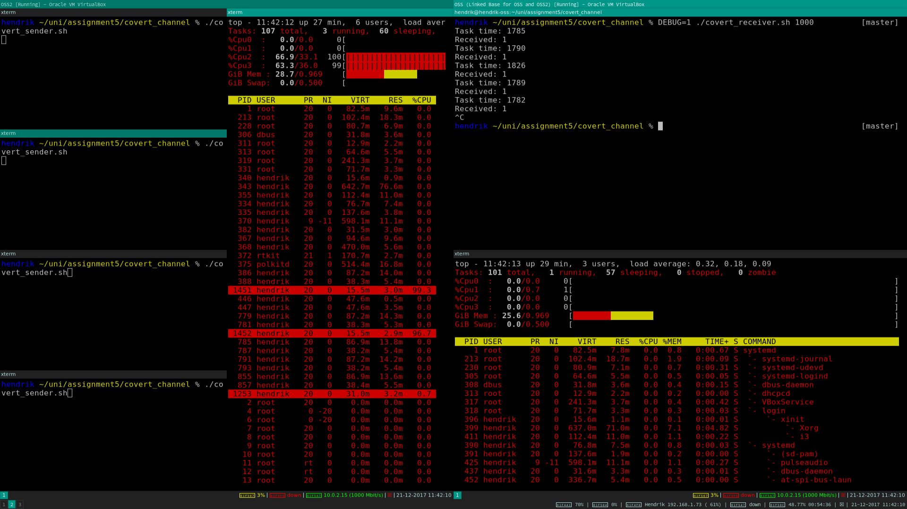

# 1
If you do not use `bash` as your shell, to chroot into the Debian folder, run `chroot debian /bin/sh`, to avoid errors like this:

`chroot: failed to run command ‘/usr/bin/zsh’: No such file or directory`

If you use a Linux distribution that does not have Debian's executable folders in its `PATH`, you will have trouble running any commands. To rectify the problem, run `export PATH=$PATH:/usr/sbin/:/sbin:/bin`. After that you should be able to run commands like `ls` and `cd` like normal.

We followed the provided instructions, but they contain an error. We had to use `chroot` in place of `chdir` at step 5. After this change, breaking the chroot jail worked flawlessly.

## a
We can create a symbolic link, but it does not work inside the chroot jail:

```bash
hendrik ~ % echo test > testfile
hendrik ~ % cat testfile 
test
hendrik ~ % sudo ln -s testfile debian/testlink
hendrik ~ % sudo chroot debian /bin/bash
root@hendrik-oss:/# cat testlink 
cat: testlink: No such file or directory
root@hendrik-oss:/# ls -l testlink
lrwxrwxrwx 1 root root 8 Dec 18 19:09 testlink -> testfile
```

We tried to use the full path as well, but this does not work either:

```bash
hendrik ~ % sudo rm debian/testlink
hendrik ~ % sudo ln -s ~/testfile debian/testlink
hendrik ~ % sudo chroot debian /bin/bash
root@hendrik-oss:/# cat testlink
/bin/cat: testlink: No such file or directory
root@hendrik-oss:/# ls -l testlink
lrwxrwxrwx 1 root root 22 Dec 18 19:14 testlink -> /home/hendrik/testfile
```

Finally we tried a relative symlink, but this also does not work:

```bash
hendrik ~ % sudo rm debian/testlink
hendrik ~ % cd debian
hendrik ~/debian % sudo ln -rs ../testfile testlink
hendrik ~/debian % sudo chroot . /bin/bash
root@hendrik-oss:/# cat testlink
/bin/cat: testlink: No such file or directory
root@hendrik-oss:/# ls -l testlink
lrwxrwxrwx 1 root root 11 Dec 18 19:24 testlink -> ../testfile
```

## b
Hard links allow us to break the chroot jail:

```bash
hendrik ~ % echo test > testfile
hendrik ~ % cat testfile
test
hendrik ~ % sudo ln testfile debian/testlink
hendrik ~ % sudo chroot debian /bin/bash
root@hendrik-oss:/# cat testlink
test
```

The reason hard links still work is that they directly point to the inode on the file system, and symbolic links do not work because they point to a file, which points to the inode. Hard links create another handle for the inode, while symbolic links just create a handle for the original file which points to the inode. If the file is not reachable, the symbolic link cannot find the inode.

Here is an illustration of the concept:

\begin{tikzpicture}[
	every node/.style = {circle, draw, minimum width=7em},
	arrow/.style = {->, very thick},
	scale = 3,
]
	\node (inode) at (0, 1) {inode};
	\node (testfile) at (1, 0) {testfile};
	\node (hardlink) at (-1, 0) {hard link};
	\node (symlink) at (3, 0) {symbolic link};

	\draw[arrow] (testfile) -- (inode);
	\draw[arrow] (hardlink) -- (inode);
	\draw[arrow] (symlink) -- (testfile);
\end{tikzpicture}

## c
Before the updated assignment was put online, we already wrote a program which enables us to escape the chroot jail. After executing the program, a new bash shell is opened (outside the chroot environment). There we can show the contents of any file, using 'cat <filename>'. We left it like that, as this is actually much more powerful than what was later asked in the updated assignment. You can do whatever you want in the bash shell.

To answer the question as it is asked, execute our program `jailbreak`, and then open the desired file using `cat`, `less` etc.. Because we don't read a specific file after escaping the chroot jail, our program is applicable to any situation.

## d
The jailbreak does not work as an unprivileged user, because `chroot` can only be called as root, to prevent privilege escalation. If you could use `chroot` as a normal user, you could make your own versions of important files like `/etc/sudoers`, `/etc/shadow`, …

For example, by making your own custom `/etc/sudoers` file with your user name, then using `sudo`, which checks that file, you could get root privileges as a normal user. You cannot use `chroot` as a normal user though, so this scenario is prevented.

# 2
We did not use VMWare for this exercise but stuck with VirtualBox, because we already had that installed from the earlier exercises, and because it worked without problems. We hope this is not a problem. The covert channel should work with VMWare as well.

We decided to use CPU usage as our covert channel. Even if the two virtual machines are separated completely, they can still see each others CPU usage, as long as they are running on the same CPU core(s). It is not possible to directly observe the CPU usage from another VM, but we can indirectly measure it, by timing a CPU intensive task. To this end we we wrote `cpu_intensive_task.sh`, which simply writes a lot of values to `/dev/null`. The execution time of this task is reasonably constant, so we can use it as a measure of how busy the CPU is.

A threshold of 1000ms was used for all our tests, and this worked well in our case. You may have to use a different threshold. To gage the threshold you need, start the covert receiver in debug mode (`DEBUG=1 ./covert_receiver.sh …`) in one VM, and as many instances of the covert sender as you intent to run in a second VM. Choose a threshold somewhere in between the time the tasks takes without any senders running, and with the senders running.

There is always a little natural fluctuation in the time our test tasks takes, so there should be a buffer on either side of the threshold. To make the gap big enough it can be necessary to run multiple instances of the cover sender simultaneously. 2 instances mostly worked well for us, 3 always worked, and 4 also always worked, but may be overkill.

To run the covert channel test yourself, start 2 VMs, and assign them both to run on all CPU cores (so they actually interfere with each other). In VM2 start the covert receiver with a suitable (see above) threshold. You should see that the covert receiver is receiving 0, meaning that the covert sender is not running. Now, in VM1 start the number of covert sender instances you chose before. You should see that the receiver running in VM2 now receives 1, meaning that the sender is running.

Both VMs have no direct communication method, but they can still indirectly observe each other.

## Screenshots
We took screenshots showcasing the covert channel in use. On each screenshot both VMs are visible, one on the left, one on the right. We used the left VM as the transmitter, while the right VM is used as the receiver. `top` is visible in both VMs on all screenshots, so you can see that it is not possible to observe CPU usage directly. We also enabled debug mode for the receiver, so you can see the time (in ms) that our test task took.





